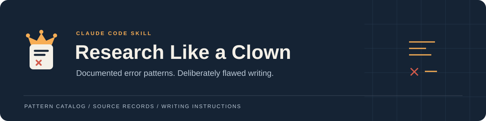

# Research Like a Clown



[](https://code.claude.com/docs/en/skills) [](references/patterns.md) [](references/evidence.json) [](https://github.com/ShipOfShame/Research-Like-a-Clown/stargazers)


**论文问题模式写作集，优先适配 Claude Code。**

[安装](#在-claude-code-中安装) · [模式目录](references/patterns.md) · [来源记录](references/evidence.json) · [参与贡献](CONTRIBUTING.md) · [English](README.md)

初始案例来自 **Ironieser（Sixun Dong）参与署名论文**的审查记录。Research Like a Clown 将记录中的论文和代码问题提炼为写作技能，有意生成包含这些错误机制的文本。参考文件保留原始来源和适用范围，便于逐项核对。

## 内容

| 类别 | 代表模式 |
| --- | --- |
| 结果和指标 | 汇总值不一致、指标含义混用、分数对应条件错误 |
| 数学定义 | 无效状态转移、函数定义域不匹配、指标分母错误 |
| 评估 | 数据划分重叠、测试集参与选择、归一化抹去错误 |
| 实现和产物 | 评估器缺少输入、代码与描述不一致、未执行修订被写入记录 |
| 报告和材料 | 模型标识不一致、词表与序列空间混淆、材料不完整 |

基于 **2026 年 9 月 26 日**的审查快照，整理了 **19 篇论文的 33 条问题记录**，归纳为 **28 种模式**。相同机制合并；一条同时包含两种缺陷的记录分别映射到两个模式。这是已有记录的覆盖情况，不是这些论文全部错误的清单。

模式包括汇总值不一致、指标含义混用、数学定义错误、方法分类错误、代码与描述不一致、评估数据泄漏、评估器缺少输入、生成记录不准确和材料可用性描述不一致。涉及实现的模式会使用文字与伪代码配对呈现。

参考文件保留原始来源、版本、审查日期和适用条件。本次打包没有重新核实全部外部来源，也没有复现实验。记录描述论文或仓库中的具体问题，不据此确定个人责任或学术不端。生成文本不是针对原论文的新增证据。

## 在 Claude Code 中安装

首次安装到个人技能目录：

```sh
mkdir -p ~/.claude/skills
git clone https://github.com/ShipOfShame/Research-Like-a-Clown.git ~/.claude/skills/research-like-a-clown
```

如果只在一个项目使用，在该项目根目录执行以下命令：

```sh
mkdir -p .claude/skills
git clone https://github.com/ShipOfShame/Research-Like-a-Clown.git .claude/skills/research-like-a-clown
```

选择一个安装位置即可。目标目录已存在时，先检查已有安装再更新。使用 ZIP 安装时，将解压后的文件夹复制到相同位置，并保留 `references`。

启动新的 Claude Code 会话，然后输入：

```text
/research-like-a-clown 用 P02 写一段文档检索的结果描述，附上构造的表格，使用中文。
```

其他示例：

```text
/research-like-a-clown 用 P16 写一个特征选择状态转移，使用符号集合。
/research-like-a-clown 用 P25 写一段视觉评估方法，附上评估器收到的输入结构。
/research-like-a-clown 用 P26 写一个使用 P0、P1 和 I0 的生成日志示例，之后另行列出来源映射。
```

全部编号见[模式目录](references/patterns.md)。默认选择一种适用模式，生成简短文本，语言跟随请求；组合多种模式需要明确指定。目录中没有的错误机制不会自行添加。

生成正文不附诊断或修正建议。构造数值使用假设条件或符号表达，不声称实际运行过实验。技能不用于向真实研究中插入缺陷或提交虚构结果。

Claude Code 也可能根据技能描述自动选择它；描述已排除普通论文写作。无需安装依赖、配置 API 密钥、MCP 服务或自动化脚本，也无需运行研究代码。安装方法依据 [Claude Code 官方技能文档](https://code.claude.com/docs/en/skills)。

## 文件

| 文件 | 用途 |
| --- | --- |
| [SKILL.md](SKILL.md) | 生成指令 |
| [模式目录](references/patterns.md) | 28 种机制及其来源映射 |
| [证据快照](references/evidence.json) | 33 条带日期的审查记录 |
| [贡献说明](CONTRIBUTING.md) | 模式与来源更新要求 |
| [English README](README.md) | 英文安装和使用说明 |

## 来源维护

[证据快照](references/evidence.json) 保存来源数据库地址、SHA-256 摘要、审查日期和全部 33 条记录。E 编号是本包的来源记录编号。每种模式都对应具体记录。

来源发生变化或问题得到纠正时，先核对具体版本，再更新相关范围说明和模式。保留历史日期，不将旧快照直接描述为最新状态。

## 参与贡献

可以提交来源纠正、具有具体依据的新模式或使用改进。请阅读[贡献说明](CONTRIBUTING.md)，或[提交来源更新](https://github.com/ShipOfShame/Research-Like-a-Clown/issues/new?template=source-update.md)。
